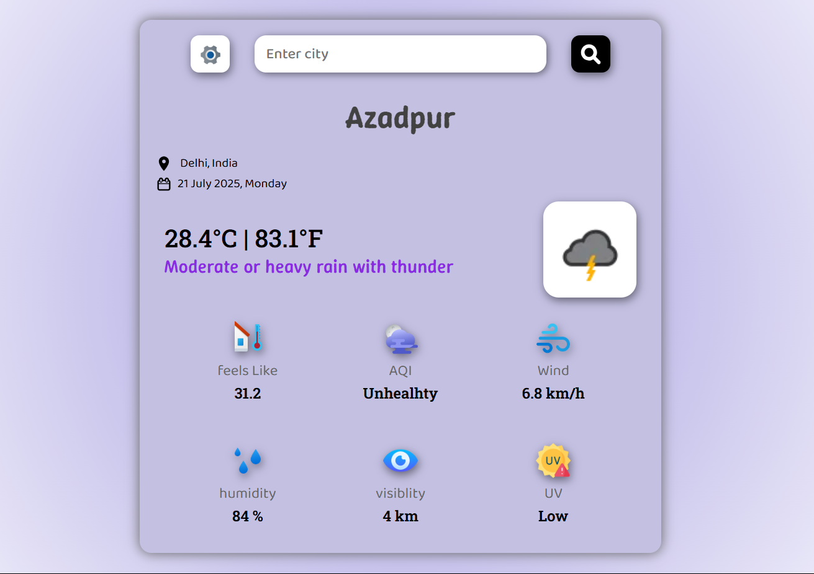
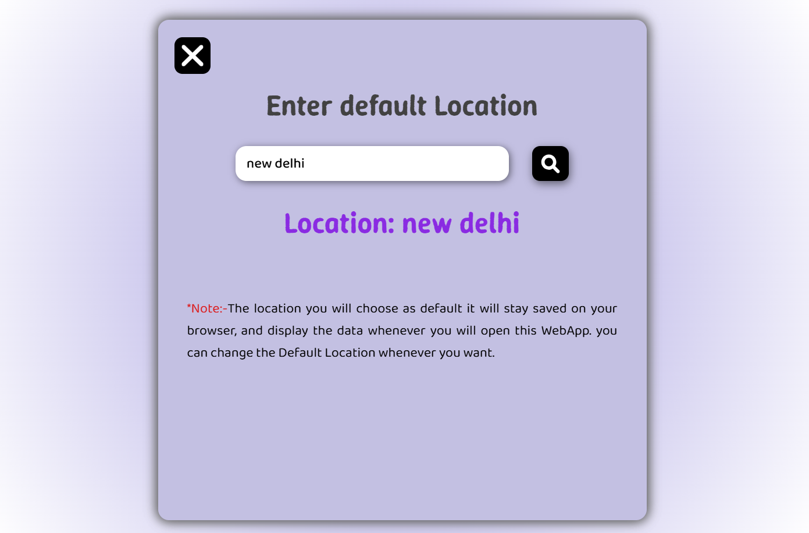

# 🌤️ AtmoPulse — *Your Smart Weather Companion*



> **AtmoPulse** is a fully responsive, smooth-animated weather forecasting web app built using JavaScript and the [WeatherAPI](https://www.weatherapi.com/). Enter any location to get real-time weather, temperature, AQI, UV index, and more — all wrapped in a sleek, modern interface!

---

## 🚀 Features

✅ **Live Weather Updates**  
✅ **Dual Search Input** (Search & Set Default Location)  
✅ **Air Quality Index (AQI)** with intuitive health labels  
✅ **UV Index** with dynamic risk levels  
✅ **Weather Icons & Animations**  
✅ **Responsive UI** for **mobile, tablet, and desktop**  
✅ **Modern UI/UX** with smooth transitions  

---

## 📱 Responsive Design

> Looks great on **all screen sizes** — mobile 📱, tablet 💻, and desktop 🖥️!


---

## 🧪 Tech Stack

| Frontend  | API            | Animations | Storage      |
|-----------|----------------|------------|--------------|
| HTML5     | WeatherAPI     | CSS + JS   | LocalStorage |
| CSS3      |                |            |              |
| JavaScript|                |            |              |

---

## 🌍 Live Preview

🔗 [Live Demo (optional if hosted)](https://atmopulse.netlify.app)

---

## 🖼️ Screenshots

<p float="left">
  
    
</p>

---

## 📦 Installation & Usage

```bash
# Clone the repository
git clone https://github.com/DevloperAryan/Projects/atmopulse.git

# Navigate into the folder
cd atmopulse

# Open index.html in your browser
```

> 💡 Make sure to replace the API key in the JS file with your own WeatherAPI key.

```js
const apiKey = 'YOUR_API_KEY_HERE';
```

---

## 🔍 Search Input UX

💡 Use either of the two input fields:
- 🔎 Top field: Instant search  
- 🌐 Bottom field: Save your default location (stored in `localStorage`)

---

## 📁 Project Structure

```
Atmopulse/
│
├── index.html
├── style.css
├── script.js
├── assets/
│   ├── weather-icons/
│   ├── loc-Icon.svg
│   └── calender.svg
```

---

## 📸 Dynamic Outputs

| Parameter     | Example          |
|---------------|------------------|
| Temperature   | `29°C | 84.2°F`   |
| Weather       | `Partly Cloudy`  |
| AQI           | `Fair`           |
| UV Index      | `Moderate`       |
| Wind Speed    | `18 km/h`        |
| Humidity      | `62%`            |
| Visibility    | `10 km`          |

---

## 🧠 Fun Fact

> Atmopulse automatically displays the **default location** and **today’s date** on load using JavaScript + `localStorage`. No backend needed!

---

## 📌 Todo / Future Scope

- 🌧️ 5-Day Weather Forecast
- 📍 GPS-Based Auto Location
- 🌒 Dark/Light Theme Toggle
- 🔔 Weather Alerts

---

## 👨‍💻 Author

**Aryan Kumar**  
📫 [Email] : aryankumar.linux@gmail.com  
📎 [Portfolio](https://aboutaryan.netlify.app)

---

## ⭐ Show your support

If you like the project, consider ⭐ **starring** the repository! It helps a lot!

---

### 🧊 Made with ❤️ by Aryan — _Feel the Weather with Atmopulse!_

